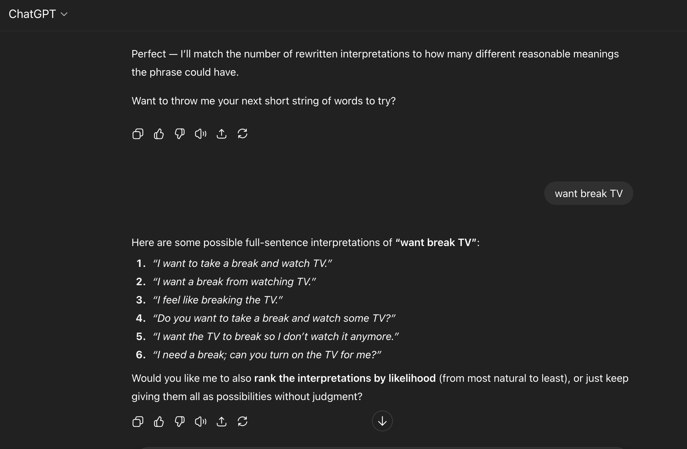

<!-- This is the markdown template for the final project of the Building AI course, 
created by Reaktor Innovations and University of Helsinki. 
Copy the template, paste it to your GitHub README and edit! -->

# Augmentative-and-Alternative-Communication-with-AI
using NLP to assist people with disabilities in generating and interpreting speech

Final project for the Building AI course

## Summary

The purpose of this project is to use AI to augment existing AAC (augmentative and alternative communication) devices/applications for people with disabilities affecting communication. This project would take simplified inputs from users and would generate multiple predictions of the user's intended message. Additionally, this application would take complex pieces of text or speech and rewrite it in simplified language to make it easier for the user to understand without requiring excess time or effort.

## Background

AAC is probably most widely known for its use by nonspeaking autistic people. However, there is a wide range of other disabilities that can also affect communication and which may be supported with AAC, including:

* dementia
* strokes
* traumatic brain injuries
* brain cancers
* motor neuron diseases
* cerebral palsy
* and more

Despite AAC's association with autism, non-autistic people also have a good reason to be invested in quality AAC-- not only can anyone become affected by communication disorders at any time in their lives, but non-autistic people may still meet, work with, or become the relative of a nonspeaking autistic person at some point in their lives. Therefore everyone would benefit from expanding communication options for people with disabilities affecting communication. 

For disabled users, being able to quickly express themselves in language that is easy for others to understand helps reduce dangerous communication challenges (such as reporting abuse, dealing with law enforcement/security personnel, or describing medical problems) and also helps users live with more dignity and respect from their communities.

## How is it used?

AAC devices/applications can take many different forms depending on the user's limitations and support needs. 

Some users may have no trouble understanding language or explicitly planning what they mean to say, but may mainly struggle with the motor control needed to produce speech or write text. These users may use a letterboard, eye tracking, or hunt-and-peck typing to produce text. These users may be able to produce grammatically correct and easy-to-understand text, but it's often time-consuming to produce and may require physical support from another person. This can cause doubts about whether the support person is inserting their own influence into the generated text (see the Derrick Johnson/Anna Stubblefield case).

A letterboard:

Hunt-and-peck typing:

An eye tracking device:

Other users may struggle with understanding language, such as understanding/remembering words without pictoral representations, understanding correct grammar usage, etc. These users may use apps or devices that break words down by category/frequency and labels word buttons with a corresponding image/icon to make them easier for the user to identify.

An AAC app with images/icons:

Example setup of AAC app:

Unlike traditional predictive text, this app would not simply predict individual words based on user input. Rather, this app would take a string of short words (which could, for example, be typed with predictive text or icon-based AAC) and would generate multiple examples in long-form, grammatically correct sentences. The user could then chose from the list of longer messages to express their true intent.

The app would also have an option to take complex input text and rewrite it in simplified language to be easier to follow and understand for users with attention or receptive language issues.

## Data sources and AI methods

This project would employ an NLP like ChatGPT to make predictions about the user's intended message based on a very limited/simplified input. Messages would be generated based on the frequency of the key words inputted. Similarly, complex messages for the user could be simplified with an NLP like ChatGPT.

The model could also potentially update its training data with each user choice to get a better sense of how each individual user tends to use keywords and what the individual user's preferences are.

## Challenges

The AI-generated responses based on user input may not always accurately predict the user's intentions, leaving room for miscommunication. For some people with communication challenges, it can be difficult to determine if they have other impairments e.g. with comprehension or cognitive challenges that could make the app more difficult to use. 

## What next?

In order to implement this project I would need to learn more about app development or work with someone with experience in app development to actually create it. It may also be beneficial to consult with a nonspeaking autistic person about what they would find helpful.

## Acknowledgments

* list here the sources of inspiration 
* do not use code, images, data etc. from others without permission
* when you have permission to use other people's materials, always mention the original creator and the open source / Creative Commons licence they've used
   For example: [Sleeping Cat on Her Back by Umberto Salvagnin](https://commons.wikimedia.org/wiki/File:Sleeping_cat_on_her_back.jpg#filelinks) / [CC BY 2.0](https://creativecommons.org/licenses/by/2.0)
* etc
